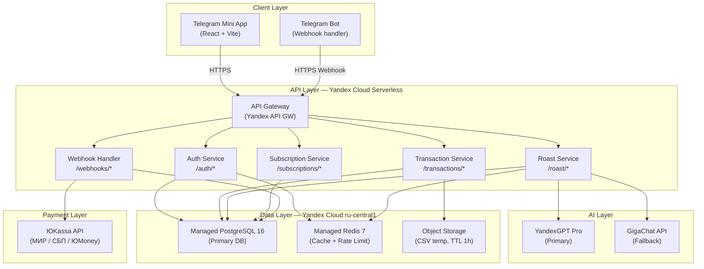

# Architecture — «Клёво»

> SPARC Phase 5 · ARCHITECTURE · System Design  
> Дата: 2026-04-09

---

## Architecture Overview

**Стиль:** Distributed Monolith (Monorepo)  
Один репозиторий, чёткие модульные границы. Serverless deployment на Yandex Cloud. Масштабируется горизонтально без изменений кода.

---

## High-Level Diagram



---

## Component Breakdown

### Frontend — Telegram Mini App

| Компонент | Технология | Назначение |
|---|---|---|
| UI Framework | React 18 + Vite 5 | SPA внутри Telegram |
| Стили | TailwindCSS 3 | Утилитарный CSS |
| Чарты | Recharts | Пай-чарт трат |
| State | Zustand | Глобальное состояние |
| API client | Axios + React Query | Запросы к backend |
| Telegram SDK | @twa-dev/sdk | initData, theme, haptics |

**Структура компонентов:**

```
src/
├── pages/
│   ├── Welcome.tsx          # Демо + CTA
│   ├── Onboarding.tsx       # 4-шаговый онбординг
│   ├── Dashboard.tsx        # Главный экран
│   ├── RoastMode.tsx        # Жёсткий режим
│   ├── Subscriptions.tsx    # Подписки-паразиты
│   ├── BNPL.tsx             # BNPL-трекер
│   └── Paywall.tsx          # Upgrade screen
├── components/
│   ├── SpendingChart.tsx    # Recharts пай-чарт
│   ├── RoastCard.tsx        # Roast display + share
│   ├── TransactionList.tsx  # Список транзакций
│   └── PaymentWidget.tsx    # ЮKassa widget
└── store/
    └── useAppStore.ts       # Zustand store
```

---

### Backend — Fastify Monorepo

```
apps/
├── api/                     # Fastify API server
│   ├── routes/
│   │   ├── auth.ts
│   │   ├── transactions.ts
│   │   ├── roast.ts
│   │   ├── subscriptions.ts
│   │   └── webhooks.ts
│   ├── plugins/
│   │   ├── jwt.ts           # JWT verify plugin
│   │   ├── rateLimit.ts     # Redis-backed rate limiter
│   │   └── telegram.ts      # initData validator
│   └── services/
│       ├── CsvParser.ts
│       ├── Categorizer.ts
│       ├── SubscriptionDetector.ts
│       ├── RoastGenerator.ts
│       └── PaymentService.ts
└── bot/                     # Telegram Bot webhook handler
    └── index.ts
packages/
├── db/                      # Prisma schema + migrations
│   ├── schema.prisma
│   └── migrations/
└── shared/                  # Shared types
    └── types.ts
```

---

## Technology Stack

| Слой | Технология | Версия | Обоснование |
|---|---|---|---|
| Frontend | React | 18 | Де-факто стандарт; TMA SDK для React |
| Build | Vite | 5 | Быстрый HMR; лёгкий bundle |
| Стили | TailwindCSS | 3 | Скорость верстки; Telegram dark/light themes |
| Backend | Node.js | 22 LTS | Единый язык с фронтом |
| Framework | Fastify | 5 | В 2x быстрее Express; plugin система |
| Language | TypeScript | 5 | Типобезопасность |
| ORM | Prisma | 5 | Type-safe queries; миграции |
| Database | PostgreSQL | 16 | ACID; JSONB; Row Level Security |
| Cache | Redis | 7 | Session store; rate limiting; LLM cache |
| AI Primary | YandexGPT Pro | latest | ФЗ-152; данные в РФ |
| AI Fallback | GigaChat API | latest | Резервный LLM |
| Payments | ЮKassa | v3 | МИР + СБП + ЮMoney |
| Auth | Telegram initData | — | Zero-friction; no passwords |
| Hosting | Yandex Cloud | — | ru-central1; ФЗ-152 |
| CI/CD | GitHub Actions | — | Автодеплой при push в main |
| Monitoring | Yandex Monitoring | — | Метрики + алерты |

---

## Data Architecture

### Database Schema (Prisma)

```prisma
model User {
  id               String    @id @default(uuid())
  telegramId       BigInt    @unique
  telegramUsername String?
  displayName      String
  plan             Plan      @default(FREE)
  planExpiresAt    DateTime?
  referralCode     String    @unique @default(nanoid(8))
  referredBy       String?
  consentGivenAt   DateTime
  createdAt        DateTime  @default(now())
  updatedAt        DateTime  @updatedAt

  transactions     Transaction[]
  roastSessions    RoastSession[]
  subscriptions    DetectedSubscription[]
  klyovoSubs       KlyovoSubscription[]
}

model Transaction {
  id                 String   @id @default(uuid())
  userId             String
  amountKopecks      Int
  merchantName       String
  merchantNormalized String
  category           Category
  transactionDate    DateTime
  source             Source
  rawDescription     String?
  isBnpl             Boolean  @default(false)
  bnplService        String?
  createdAt          DateTime @default(now())

  user User @relation(fields: [userId], references: [id])
  @@index([userId, transactionDate])
}

model RoastSession {
  id               String   @id @default(uuid())
  userId           String
  roastText        String
  spendingSummary  Json
  mode             String
  sharedAt         DateTime?
  createdAt        DateTime @default(now())

  user User @relation(fields: [userId], references: [id])
  @@index([userId, createdAt])
}

enum Plan { FREE PLUS }
enum Category { FOOD_CAFE GROCERIES MARKETPLACE TRANSPORT SUBSCRIPTIONS ENTERTAINMENT HEALTH CLOTHING EDUCATION OTHER }
enum Source { CSV_SBER CSV_TBANK MANUAL }
```

---

## Authentication Flow

```
[TMA] → window.Telegram.WebApp.initData
         ↓
[TMA] POST /auth/telegram { initData }
         ↓
[API] Extract hash from initData
[API] Compute HMAC-SHA256(data_check_string, SHA256(BOT_TOKEN))
[API] Compare computed_hash == received_hash
         ↓
   ✅ Valid          ❌ Invalid
      ↓                   ↓
[API] Find/Create     [API] 401
      User in DB
      ↓
[API] Issue JWT (7d)
[API] Return { token, user }
```

---

## LLM Integration Architecture

```
[RoastService.generate()]
         ↓
[Build prompt] → system_prompt + user_prompt (трата данные)
         ↓
[Try YandexGPT Pro]
  ↓ Success          ↓ Timeout (5s) / Error
[Return text]   [Try GigaChat]
                  ↓ Success          ↓ Error
                [Return text]   [Return cached fallback roast]
                                [Alert: LLM_UNAVAILABLE]
```

**Prompt Engineering (Жёсткий режим):**

```
System: Ты — Клёво, финансовый ИИ с характером. Ты говоришь правду 
        о тратах пользователя — честно, с юмором, без жалости. 
        Пиши по-русски, на «ты», неформально. Не оскорбляй, не матерись.
        Будь конкретным: используй реальные суммы из данных.
        Максимум 3 абзаца, без вводных фраз типа «Ок, смотрю твои траты».

User:   Апрель 2026. Всего потрачено: ₽47 320.
        Топ траты: Еда и кафе ₽12 400, WB/Ozon ₽9 800, Подписки ₽4 200.
        Активных BNPL-долгов: ₽8 400.
        Забытых подписок: 3.
        Сгенерируй roast.
```

---

## Security Architecture

| Аспект | Реализация |
|---|---|
| Auth | Telegram HMAC-SHA256 initData; JWT HS256 (7d TTL) |
| Transport | HTTPS/TLS 1.3 everywhere |
| Database | Row Level Security (Prisma); encrypted at rest (Yandex Cloud) |
| CSV файлы | Удаляются из Object Storage через 1 час (lifecycle rule) |
| Rate Limiting | 100 req/min per user (Redis); 20 roasts/hour per user |
| Input Validation | Zod схемы на каждом endpoint |
| SQL | Parameterized queries (Prisma — no raw SQL в MVP) |
| Secrets | Yandex Lockbox (не .env в production) |
| ПД | AES-256 at rest; только ru-central1 |

---

## Scalability

| Компонент | Текущий лимит | Масштабирование |
|---|---|---|
| API | Serverless (auto-scale) | Без действий |
| PostgreSQL | 2 vCPU, 4GB RAM (старт) | Vertical: 8 vCPU; Horizontal: read replicas |
| Redis | 1GB (старт) | Vertical до 8GB |
| YandexGPT | По тарифу | Увеличить квоту |
| Object Storage | Безлимитный | — |

**Bottleneck:** LLM response time (~2–4 сек). Митигация: Redis caching схожих запросов (TTL 1ч).
