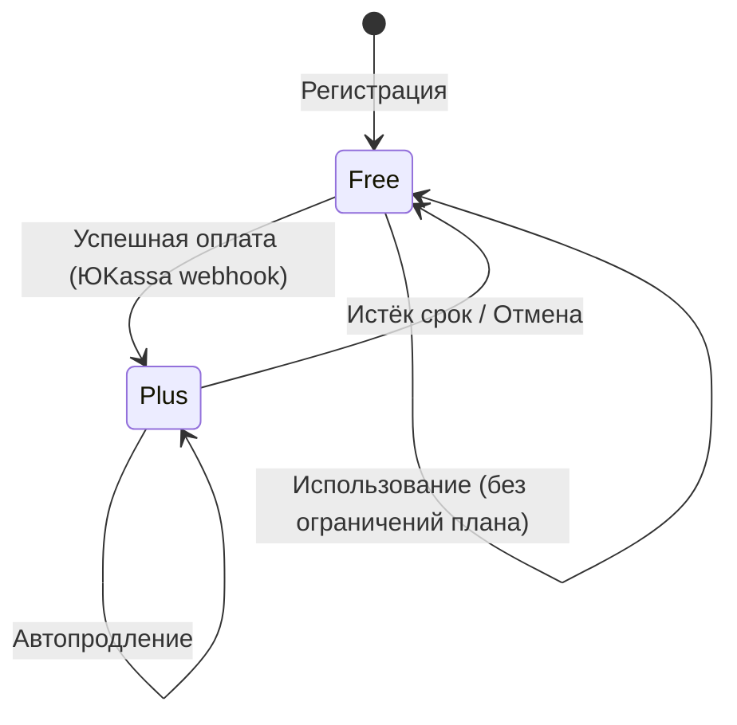
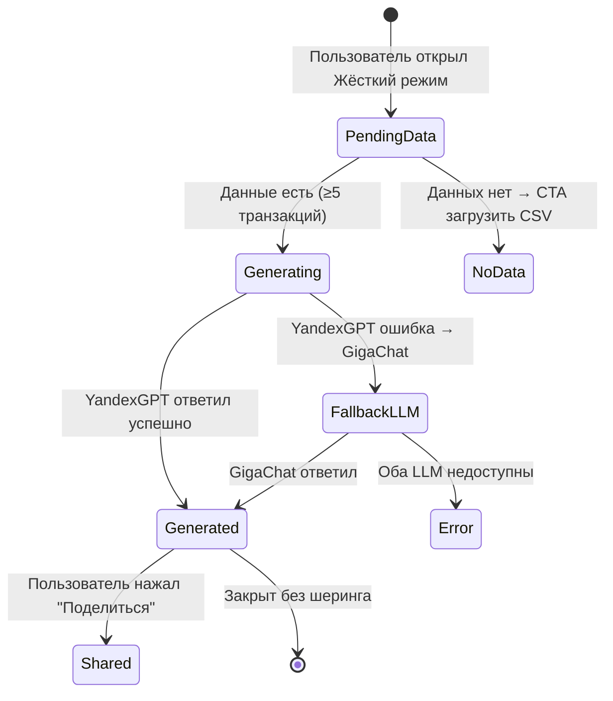

# Pseudocode — «Клёво»

> SPARC Phase 4 · PSEUDOCODE · Алгоритмы, Data Structures, API Contracts  
> Дата: 2026-04-09

---

## Data Structures

### User
```typescript
type User = {
  id: UUID
  telegram_id: bigint           // Telegram user ID
  telegram_username: string | null
  display_name: string
  plan: 'free' | 'plus'
  plan_expires_at: Timestamp | null
  referral_code: string         // unique, 8 chars
  referred_by: UUID | null
  consent_given_at: Timestamp
  created_at: Timestamp
  updated_at: Timestamp
}
```

### Transaction
```typescript
type Transaction = {
  id: UUID
  user_id: UUID
  amount: number                // в копейках (целое число, избегаем float)
  currency: 'RUB'
  merchant_name: string
  merchant_normalized: string   // нормализованное название (lower, trim)
  category: TransactionCategory
  transaction_date: Date
  source: 'csv_sber' | 'csv_tbank' | 'manual'
  raw_description: string | null
  is_bnpl: boolean
  bnpl_service: 'dolyami' | 'split' | 'podeli' | null
  created_at: Timestamp
}

type TransactionCategory =
  | 'food_cafe'        // Еда и кафе
  | 'groceries'        // Продукты
  | 'marketplace'      // WB, Ozon, Яндекс Маркет
  | 'transport'        // Такси, метро, кикшеринг
  | 'subscriptions'    // Подписки
  | 'entertainment'    // Развлечения
  | 'health'           // Здоровье и аптеки
  | 'clothing'         // Одежда
  | 'education'        // Образование
  | 'other'            // Прочее
```

### RoastSession
```typescript
type RoastSession = {
  id: UUID
  user_id: UUID
  roast_text: string
  spending_summary: SpendingSummary  // JSONB
  mode: 'harsh' | 'soft'
  shared_at: Timestamp | null
  created_at: Timestamp
}

type SpendingSummary = {
  period_start: Date
  period_end: Date
  total_amount: number           // в копейках
  top_categories: Array<{
    category: TransactionCategory
    amount: number
    percentage: number
  }>
  subscriptions_found: number
  bnpl_total: number
}
```

### Subscription
```typescript
type Subscription = {
  id: UUID
  user_id: UUID
  merchant_name: string
  estimated_amount: number       // в копейках
  frequency_days: number         // ~30 = ежемесячная
  last_charge_date: Date
  occurrences: number            // сколько раз обнаружена
  status: 'active' | 'cancelled' | 'ignored'
  created_at: Timestamp
}
```

### UserSubscription (платная подписка на Клёво)
```typescript
type KlyovoSubscription = {
  id: UUID
  user_id: UUID
  plan: 'plus_monthly' | 'plus_yearly'
  status: 'active' | 'cancelled' | 'expired'
  yookassa_payment_id: string
  started_at: Timestamp
  expires_at: Timestamp
  created_at: Timestamp
}
```

---

## Core Algorithms

### Algorithm: CSV Parser (Сбер / Т-Банк)

```
FUNCTION parseCSV(fileBuffer, bankType):
  INPUT:  fileBuffer (Buffer), bankType ('sber' | 'tbank')
  OUTPUT: Transaction[] | ParseError

  1. DECODE fileBuffer as UTF-8 (or Windows-1251 if UTF-8 fails)
  2. SPLIT by newline → rows[]
  3. IF bankType == 'sber':
       header_row = rows[0]
       VALIDATE header_row contains ['Дата', 'Сумма', 'Описание']
       date_col = 0, amount_col = 5, desc_col = 8
  4. IF bankType == 'tbank':
       SKIP rows until row starts with 'Дата операции'
       date_col = 0, amount_col = 6, desc_col = 2
  5. FOR each row (skip header):
       a. PARSE date from date_col (formats: dd.mm.yyyy, yyyy-mm-dd)
       b. PARSE amount: remove spaces, replace comma→dot, PARSE as float
          MULTIPLY by 100 → integer kopecks
          IF amount > 0: SKIP (income, not expense)
          ELSE: amount = abs(amount)
       c. merchant_name = TRIM(desc_col)
       d. category = categorizeMerchant(merchant_name)
       e. is_bnpl = detectBNPL(merchant_name)
       f. APPEND Transaction{...}
  6. IF rows parsed == 0: RETURN ParseError('empty_file')
  7. RETURN transactions[]

COMPLEXITY: O(n) where n = number of rows
```

---

### Algorithm: Merchant Categorization

```
FUNCTION categorizeMerchant(merchantName):
  INPUT:  merchantName (string)
  OUTPUT: TransactionCategory

  1. normalized = LOWERCASE(TRIM(merchantName))

  2. DEFINE keyword_map = {
       'marketplace': ['wildberries', 'wb', 'ozon', 'яндекс маркет', 'aliexpress'],
       'food_cafe':   ['kfc', 'mcdonald', 'бургер', 'пицца', 'яндекс еда', 'delivery', 'вкусвилл', 'самокат'],
       'transport':   ['яндекс такси', 'uber', 'яндекс go', 'whoosh', 'urent', 'метро'],
       'subscriptions': ['netflix', 'spotify', 'яндекс плюс', 'vk музыка', 'telegram premium'],
       'health':      ['аптека', 'apteka', 'сбер здоровье', 'eapteka'],
       'groceries':   ['пятёрочка', '5ka', 'магнит', 'перекрёсток', 'лента'],
     }

  3. FOR each (category, keywords) in keyword_map:
       FOR each keyword in keywords:
         IF normalized CONTAINS keyword:
           RETURN category

  4. RETURN 'other'   // fallback

COMPLEXITY: O(k) where k = total keywords (~50)
```

---

### Algorithm: Roast Generation

```
FUNCTION generateRoast(userId, spendingSummary, mode):
  INPUT:  userId (UUID), spendingSummary (SpendingSummary), mode ('harsh' | 'soft')
  OUTPUT: string (roast text)

  1. CHECK roast_count_this_month(userId)
     IF count >= 3 AND user.plan == 'free':
       RETURN PaywallError('roast_limit_reached')

  2. cache_key = hash(userId + current_month + top_categories)
  3. cached = REDIS.get(cache_key)
  4. IF cached: RETURN cached

  5. system_prompt = buildSystemPrompt(mode)
     // mode='harsh': саркастичный, прямолинейный
     // mode='soft':  мягкий, поддерживающий

  6. user_prompt = buildUserPrompt(spendingSummary)
     // Включает: топ-3 категории, суммы, количество подписок, BNPL

  7. response = YandexGPT.chat([
       { role: 'system', content: system_prompt },
       { role: 'user', content: user_prompt }
     ], {
       temperature: 0.85,
       max_tokens: 300,
       model: 'yandexgpt-pro'
     })

  8. roast_text = response.alternatives[0].message.text

  9. VALIDATE roast_text:
     IF contains_offensive_words(roast_text):
       roast_text = RETRY step 7 (max 2 retries)
     IF length > 500 chars: TRUNCATE at last sentence

  10. REDIS.set(cache_key, roast_text, TTL=3600)

  11. SAVE RoastSession{ user_id, roast_text, spendingSummary, mode }

  12. INCREMENT roast_count_this_month(userId)

  13. RETURN roast_text

COMPLEXITY: O(1) + external LLM call (~2–4 sec)
```

---

### Algorithm: Subscription Detection

```
FUNCTION detectSubscriptions(transactions):
  INPUT:  transactions (Transaction[]) sorted by date DESC
  OUTPUT: Subscription[]

  1. GROUP transactions by merchant_normalized
  2. FOR each (merchant, txns) in groups:
       a. IF len(txns) < 2: SKIP
       b. SORT txns by date ASC
       c. gaps = [txns[i+1].date - txns[i].date for i in 0..len-2]
       d. avg_gap_days = MEAN(gaps)
       e. IF avg_gap_days BETWEEN 25 AND 35:   // monthly subscription
            frequency = 30
       f. ELIF avg_gap_days BETWEEN 6 AND 8:   // weekly
            frequency = 7
       g. ELSE: SKIP
       h. amount_values = [txn.amount for txn in txns]
          IF stddev(amount_values) / mean(amount_values) > 0.1: SKIP // unstable amount
       i. APPEND Subscription{
            merchant_name: merchant,
            estimated_amount: ROUND(MEAN(amount_values)),
            frequency_days: frequency,
            last_charge_date: txns.last.date,
            occurrences: len(txns)
          }
  3. RETURN subscriptions[]

COMPLEXITY: O(n log n) where n = number of transactions
```

---

## API Contracts

### POST /auth/telegram
```
Request:
  Headers: { Content-Type: application/json }
  Body: {
    initData: string   // raw Telegram WebApp.initData
  }

Response (200):
  {
    token: string,     // JWT, expires in 7 days
    user: {
      id: UUID,
      display_name: string,
      plan: 'free' | 'plus',
      plan_expires_at: string | null
    }
  }

Response (401):
  { error: { code: 'INVALID_INIT_DATA', message: 'Авторизация не удалась' } }

Response (429):
  { error: { code: 'RATE_LIMIT', message: 'Слишком много запросов' } }
```

---

### POST /transactions/import
```
Request:
  Headers: {
    Authorization: Bearer <token>,
    Content-Type: multipart/form-data
  }
  Body (form-data): {
    file: File,
    bank_type: 'sber' | 'tbank'
  }

Response (200):
  {
    imported_count: number,
    period: { from: string, to: string },
    categories_summary: Array<{ category: string, total: number }>
  }

Response (400):
  { error: { code: 'PARSE_ERROR', message: 'Не удалось прочитать файл' } }

Response (413):
  { error: { code: 'FILE_TOO_LARGE', message: 'Файл не должен превышать 5MB' } }
```

---

### POST /roast/generate
```
Request:
  Headers: { Authorization: Bearer <token> }
  Body: {
    mode: 'harsh' | 'soft',
    period_days: 30 | 60 | 90
  }

Response (200):
  {
    roast_id: UUID,
    roast_text: string,
    spending_summary: SpendingSummary,
    share_url: string    // https://t.me/klyovobot?start=roast_<id>
  }

Response (402):
  { error: { code: 'PLAN_LIMIT', message: 'Лимит roast на бесплатном плане исчерпан' } }

Response (503):
  { error: { code: 'LLM_UNAVAILABLE', message: 'AI временно недоступен. Попробуй через минуту' } }
```

---

### GET /subscriptions
```
Request:
  Headers: { Authorization: Bearer <token> }
  Query: { status?: 'active' | 'cancelled' | 'ignored' }

Response (200):
  {
    subscriptions: Array<{
      id: UUID,
      merchant_name: string,
      estimated_amount: number,
      frequency_days: number,
      last_charge_date: string,
      annual_cost: number,      // estimated_amount * (365 / frequency_days)
      status: string
    }>,
    total_monthly: number,
    total_annual: number
  }
```

---

### POST /subscriptions/checkout
```
Request:
  Headers: { Authorization: Bearer <token> }
  Body: {
    plan: 'plus_monthly' | 'plus_yearly',
    return_url: string   // Telegram deep link
  }

Response (200):
  {
    payment_id: string,         // ЮKassa payment ID
    confirmation_url: string,   // redirect to ЮKassa widget
    amount: number              // в копейках: 19900 | 149000
  }
```

---

## State Transitions

### User Plan State Machine



### Roast Session Flow



---

## Error Handling Strategy

| Код ошибки | HTTP | Причина | Ответ пользователю | Действие системы |
|---|---|---|---|---|
| `INVALID_INIT_DATA` | 401 | Telegram initData не валиден | «Открой бота заново» | Log, не блокировать |
| `PARSE_ERROR` | 400 | CSV нечитаем | «Попробуй скачать выписку снова» | Log filename |
| `FILE_TOO_LARGE` | 413 | > 5MB | «Файл слишком большой (макс 5MB)» | — |
| `PLAN_LIMIT` | 402 | Исчерпан лимит free | Paywall screen | Increment counter |
| `LLM_UNAVAILABLE` | 503 | YandexGPT + GigaChat down | «AI занят, попробуй через 1 мин» | Alert, retry queue |
| `PAYMENT_FAILED` | 402 | ЮKassa отклонил | «Оплата не прошла» | Log payment_id |
| `RATE_LIMIT` | 429 | > 100 req/min | «Слишком много запросов» | Block IP 1 мин |
