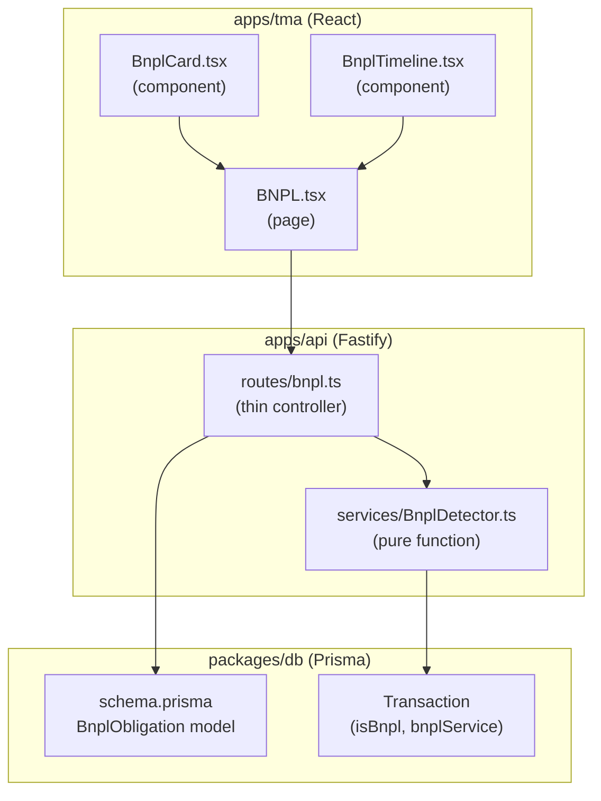

# Architecture: BNPL-трекер

## Architecture Style

Follows the existing Клёво Distributed Monolith pattern. BNPL tracker is a new vertical slice within `apps/api` (backend) and `apps/tma` (frontend), sharing `packages/db` for schema.

## Component Diagram



## New Files

```
apps/api/src/
├── routes/
│   ├── bnpl.ts                ← NEW: POST /scan, GET /, PATCH /:id
│   └── bnpl.test.ts           ← NEW: integration tests
├── services/
│   ├── BnplDetector.ts        ← NEW: keyword detection + grouping
│   └── BnplDetector.test.ts   ← NEW: unit tests

apps/tma/src/
├── pages/
│   └── BNPL.tsx               ← NEW: main page
├── components/
│   ├── BnplCard.tsx           ← NEW: obligation card
│   └── BnplTimeline.tsx       ← NEW: timeline view

packages/db/
└── schema.prisma              ← MODIFIED: add BnplObligation model + migration
```

## Database Schema Extension

```prisma
enum BnplStatus {
  active
  completed
  overdue
  dismissed
}

model BnplObligation {
  id                String     @id @default(uuid())
  userId            String
  bnplService       String     // "Долями" | "Сплит" | "Подели" | "Яндекс Сплит"
  merchantName      String     // Normalized merchant key
  merchantDisplay   String     // Human-readable merchant name
  installmentAmount Int        // Kopecks per installment
  totalInstallments Int        // Estimated total (4 for Долями/Подели, 6+ for Сплит)
  paidInstallments  Int        // Count of detected payments
  firstPaymentDate  DateTime
  lastPaymentDate   DateTime
  nextPaymentDate   DateTime?  // Projected next payment
  frequencyDays     Int        // 14 or 30
  status            BnplStatus @default(active)
  createdAt         DateTime   @default(now())
  updatedAt         DateTime   @updatedAt

  user User @relation(fields: [userId], references: [id], onDelete: Cascade)

  @@unique([userId, bnplService, merchantName, firstPaymentDate])
  @@index([userId, status])
}
```

## Data Flow: Scan

```
POST /bnpl/scan
  → requireAuth (JWT)
  → prisma.transaction.findMany({ where: { userId } })
  → BnplDetector.detect(transactions)           ← pure function, testable
  → for each detected:
      prisma.bnplObligation.upsert(...)
      prisma.transaction.updateMany({ where: { id IN detected_txn_ids }, data: { isBnpl: true, bnplService } })
  → return { found, obligations }
```

## Integration with Existing Architecture

### Consistent with docs/Architecture.md
- Routes are thin controllers (validation → service → response)
- Services are pure functions (no HTTP context)
- Prisma queries always scoped by `userId`
- Zod validation on all inputs
- RequireAuth on all routes

### Shared types
```typescript
// packages/shared/index.ts — add:
export interface BnplObligationResponse { ... }
export interface BnplSummaryResponse { ... }
export interface ScanBnplResponse { found: number; obligations: BnplObligationResponse[] }
```

## Security Architecture

- JWT `requireAuth` hook on all `/bnpl/*` routes
- Prisma query always includes `where: { userId }` 
- No raw SQL — Prisma parameterized queries only
- Zod schema validates all request bodies and params
