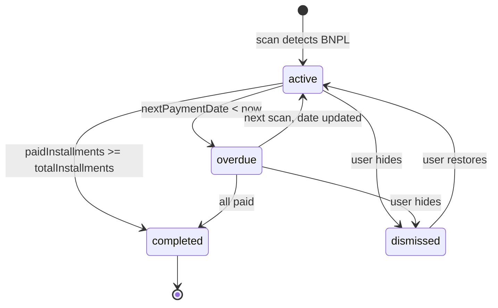

# Pseudocode: BNPL-трекер

## Data Structures

### BnplObligation (DB model)
```
type BnplObligation = {
  id:                 UUID
  userId:             String
  bnplService:        String          // "Долями" | "Сплит" | "Подели" | "Яндекс Сплит"
  merchantName:       String          // Нормализованный магазин (напр. "MVIDEO")
  merchantDisplay:    String          // Отображаемое имя (напр. "М.Видео")
  installmentAmount:  Int             // Сумма одного платежа в копейках
  totalInstallments:  Int             // Всего платежей (4 для Долями/Подели, 6 default)
  paidInstallments:   Int             // Оплачено
  firstPaymentDate:   DateTime        // Дата первого платежа
  lastPaymentDate:    DateTime        // Дата последнего зафиксированного платежа
  nextPaymentDate:    DateTime?       // Проекция следующего
  frequencyDays:      Int             // 14 или 30
  status:             BnplStatus      // active | completed | overdue | dismissed
  createdAt:          DateTime
  updatedAt:          DateTime
}

enum BnplStatus { active, completed, overdue, dismissed }
```

### BnplSummary (API response)
```
type BnplSummary = {
  totalDebtKopecks:   Int             // Сумма всех оставшихся платежей
  nextPaymentDate:    DateTime?       // Ближайший следующий платёж
  nextPaymentAmount:  Int             // Его сумма
  overdueCount:       Int             // Просроченных обязательств
  activeCount:        Int             // Активных обязательств
}
```

## Core Algorithms

### Algorithm: BnplDetector.detectProvider(merchantName)
```
INPUT: merchantName: String
OUTPUT: providerName: String | null

PROVIDER_KEYWORDS = {
  "Долями":      ["DOLYAMI", "ДОЛЯМИ", "ЯНДЕКС ДОЛЯМИ", "DOLYAMI.RU"],
  "Сплит":       ["SPLIT", "TINKOFF SPLIT", "СПЛИТ", "Т-СПЛИТ", "T-SPLIT"],
  "Подели":      ["PODELI", "ПОДЕЛИ", "СБЕР ПОДЕЛИ", "SBER PODELI"],
  "Яндекс Сплит": ["YANDEX SPLIT", "ЯНДЕКС СПЛИТ", "YA.SPLIT"],
}

normalized = merchantName.toUpperCase().trim()

FOR provider, keywords IN PROVIDER_KEYWORDS:
  FOR keyword IN keywords:
    IF normalized.includes(keyword):
      RETURN provider

RETURN null
```

### Algorithm: BnplDetector.detect(transactions)
```
INPUT: transactions: Transaction[]
OUTPUT: obligations: DetectedBnpl[]

STEPS:
1. Filter BNPL transactions:
   bnplTxns = transactions
     .filter(t => detectProvider(t.merchantNormalized) !== null)

2. Group by (provider, amountBucket, intervalType):
   groups = Map<string, Transaction[]>
   FOR txn IN bnplTxns:
     provider = detectProvider(txn.merchantNormalized)
     amountBucket = Math.round(txn.amountKopecks / 100) * 100
     key = `${provider}::${txn.merchantNormalized}::${amountBucket}`
     groups[key].push(txn)

3. FOR EACH group (key, txns):
   a. IF txns.length < 2: SKIP (not enough data points)
   
   b. Sort txns by transactionDate ASC
   
   c. Compute gaps in days between consecutive payments:
      gaps = [diff_days(txn[i], txn[i-1]) for i in 1..len]
   
   d. Determine frequencyDays:
      avgGap = mean(gaps)
      IF avgGap in [12..16]: frequencyDays = 14
      ELSE IF avgGap in [26..35]: frequencyDays = 30
      ELSE: SKIP (not a BNPL pattern)
   
   e. Verify amount stability:
      amounts = txns.map(t => t.amountKopecks)
      IF stddev(amounts) / mean(amounts) > 0.05: SKIP
   
   f. Determine totalInstallments:
      IF provider in ["Долями", "Подели"]: totalInstallments = 4
      ELSE: totalInstallments = max(txns.length + 2, 6)  // estimate
   
   g. Compute fields:
      paidInstallments = txns.length
      firstPaymentDate = txns[0].transactionDate
      lastPaymentDate = txns[last].transactionDate
      nextPaymentDate = lastPaymentDate + frequencyDays days
      installmentAmount = round(mean(amounts))
      
      IF paidInstallments >= totalInstallments:
        status = "completed"
      ELSE IF nextPaymentDate < now():
        status = "overdue"
      ELSE:
        status = "active"
   
   h. YIELD DetectedBnpl { provider, merchantName, installmentAmount,
        totalInstallments, paidInstallments, firstPaymentDate,
        lastPaymentDate, nextPaymentDate, frequencyDays, status }

4. RETURN obligations
```

### Algorithm: computeSummary(obligations)
```
INPUT: obligations: BnplObligation[] (only active + overdue)
OUTPUT: BnplSummary

totalDebt = 0
nextDate = null
nextAmount = 0

FOR ob IN obligations WHERE status IN [active, overdue]:
  remaining = ob.totalInstallments - ob.paidInstallments
  totalDebt += remaining * ob.installmentAmount
  IF ob.nextPaymentDate AND (nextDate == null OR ob.nextPaymentDate < nextDate):
    nextDate = ob.nextPaymentDate
    nextAmount = ob.installmentAmount

RETURN {
  totalDebtKopecks: totalDebt,
  nextPaymentDate: nextDate,
  nextPaymentAmount: nextAmount,
  overdueCount: obligations.filter(o => o.status == "overdue").length,
  activeCount: obligations.filter(o => o.status == "active").length
}
```

## API Contracts

### POST /bnpl/scan
```
Request:
  Headers: { Authorization: Bearer <token> }
  Body: (empty)

Response (200):
  {
    found: number,              // новых обязательств обнаружено
    obligations: BnplObligation[]
  }

Response (401): { error: { code: "UNAUTHORIZED" } }
```

### GET /bnpl
```
Request:
  Headers: { Authorization: Bearer <token> }
  Query: { status?: "active" | "completed" | "overdue" | "dismissed" }

Response (200):
  {
    obligations: (BnplObligation & { remainingAmount: number })[],
    summary: BnplSummary
  }
```

### PATCH /bnpl/:id
```
Request:
  Headers: { Authorization: Bearer <token> }
  Params: { id: UUID }
  Body: { status: "dismissed" | "active" }

Response (200):
  { obligation: BnplObligation }

Response (404): { error: { code: "NOT_FOUND" } }
```

## State Transitions



## Error Handling

| Ситуация | HTTP | Code |
|---|---|---|
| Нет JWT | 401 | UNAUTHORIZED |
| BnplObligation не найдено | 404 | NOT_FOUND |
| Нет транзакций для сканирования | 200 | found: 0 |
| Невалидный status в PATCH | 400 | VALIDATION_ERROR |
