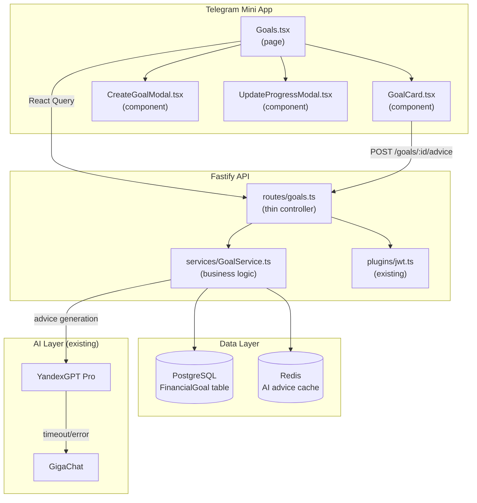

# Architecture — Финансовые цели

> SPARC Phase 5 · ARCHITECTURE  
> Дата: 2026-04-14

---

## Overview

Функция встраивается в существующий Distributed Monolith Клёво. Новых инфраструктурных компонентов не требует — используются PostgreSQL, Redis и YandexGPT/GigaChat, уже присутствующие в системе.

---

## Component Diagram



---

## New Files

### Backend
```
apps/api/src/
├── routes/
│   └── goals.ts           ← NEW: CRUD + advice endpoint
└── services/
    └── GoalService.ts     ← NEW: business logic + LLM integration
```

### Frontend
```
apps/tma/src/
├── pages/
│   └── Goals.tsx          ← NEW: goals list page
└── components/
    ├── GoalCard.tsx        ← NEW: single goal display
    ├── CreateGoalModal.tsx ← NEW: creation form
    └── UpdateProgressModal.tsx ← NEW: progress update
```

### Database
```
packages/db/
├── schema.prisma          ← MODIFIED: add FinancialGoal model + enums
└── migrations/
    └── YYYYMMDD_add_financial_goals/  ← NEW migration
```

### Shared Types
```
packages/shared/
└── types.ts               ← MODIFIED: add FinancialGoal, GoalCategory, GoalStatus types
```

---

## Integration with Existing Architecture

| Компонент | Использование |
|-----------|--------------|
| `plugins/jwt.ts` | Authenticate all /goals routes (existing) |
| `plugins/rateLimit.ts` | Rate limit /goals/:id/advice (existing Redis-backed) |
| `RoastGenerator.ts` | Reference pattern for YandexGPT → GigaChat fallback |
| `PaymentService.ts` | Reference for PLUS plan check pattern |
| `useAppStore.ts` | Add goals state slice |

---

## Security Architecture

| Аспект | Реализация |
|--------|-----------|
| Auth | JWT verify на всех `/goals/*` routes |
| Ownership | All queries scoped: `WHERE userId = req.user.id` |
| PLUS check | `req.user.plan === 'PLUS'` before AI call |
| Input validation | Zod schemas on all request body/params |
| LLM input | Только агрегированные категории, никакого PII |
| AI disclaimer | Принудительно добавляется в каждый ответ |
| Rate limit | 10 advice requests / hour per user (Redis) |

---

## Data Architecture

```
FinancialGoal (PostgreSQL)
├── id                   UUID PK
├── userId               FK → User.id (CASCADE DELETE)
├── name                 VARCHAR(100)
├── category             GoalCategory enum
├── targetAmountKopecks  INT (> 0)
├── currentAmountKopecks INT (>= 0, default 0)
├── deadline             TIMESTAMP WITH TIME ZONE (nullable)
├── status               GoalStatus enum (ACTIVE / COMPLETED / ABANDONED)
├── aiAdvice             TEXT (nullable, last generated advice)
├── aiAdviceGeneratedAt  TIMESTAMP (nullable)
├── createdAt            TIMESTAMP default now()
└── updatedAt            TIMESTAMP auto-updated

Indexes:
  @@index([userId, status])   ← primary query pattern
```

```
Redis Cache
  Key: "goal_advice:{goalId}:{spendingHash}"
  Value: JSON string { advice, generatedAt }
  TTL: 7200 seconds (2 hours)
  Purpose: Avoid duplicate LLM calls for same goal + same spending profile
```

---

## Consistency with docs/Architecture.md

- ✅ Distributed Monolith pattern maintained
- ✅ Fastify route → Service pattern
- ✅ Prisma ORM (no raw SQL)
- ✅ YandexGPT → GigaChat → cached fallback
- ✅ Redis for caching
- ✅ Zod validation on all endpoints
- ✅ JWT auth plugin reuse
- ✅ kopecks everywhere (Int, never Float)
- ✅ ФЗ-152: данные только в Yandex Cloud ru-central1
