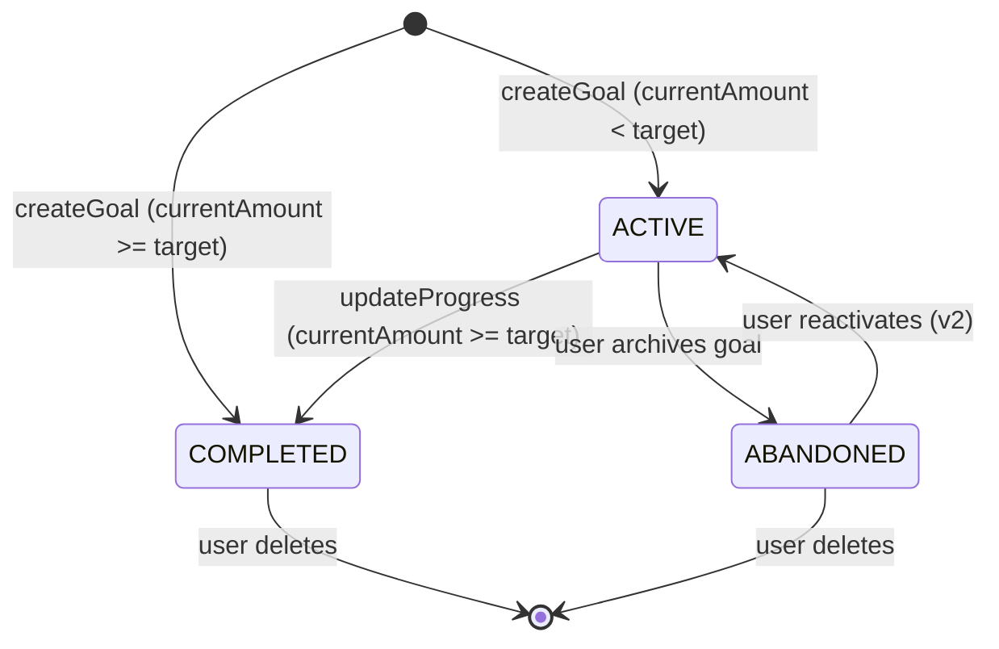

# Pseudocode — Финансовые цели

> SPARC Phase 4 · PSEUDOCODE  
> Дата: 2026-04-14

---

## Data Structures

### FinancialGoal (Prisma Model)
```
model FinancialGoal {
  id                   String      @id @default(uuid())
  userId               String
  name                 String      // "Отпуск в Турции"
  category             GoalCategory
  targetAmountKopecks  Int         // Целевая сумма в копейках
  currentAmountKopecks Int         @default(0)
  deadline             DateTime?   // Опциональный дедлайн
  status               GoalStatus  @default(ACTIVE)
  aiAdvice             String?     // Последний AI-совет (кэш в БД)
  aiAdviceGeneratedAt  DateTime?
  createdAt            DateTime    @default(now())
  updatedAt            DateTime    @updatedAt

  user User @relation(fields: [userId], references: [id], onDelete: Cascade)

  @@index([userId, status])
}

enum GoalCategory { SAVINGS EMERGENCY_FUND VACATION GADGET EDUCATION HOUSING OTHER }
enum GoalStatus   { ACTIVE COMPLETED ABANDONED }
```

---

## Core Algorithms

### Algorithm: CreateGoal
```
INPUT:
  userId: string
  name: string (1-100 chars)
  category: GoalCategory
  targetAmountKopecks: int (> 0)
  currentAmountKopecks: int (>= 0, default 0)
  deadline: DateTime? (must be future if provided)

STEPS:
1. Validate all inputs via Zod schema
2. IF user.plan == FREE:
     activeGoalCount = COUNT(FinancialGoal WHERE userId=userId AND status=ACTIVE)
     IF activeGoalCount >= 1:
       THROW AppError('GOAL_LIMIT_REACHED', 403, 'FREE limit: 1 active goal')
3. IF deadline is provided AND deadline <= now():
     THROW AppError('INVALID_DEADLINE', 400, 'Deadline must be in the future')
4. IF currentAmountKopecks >= targetAmountKopecks:
     status = COMPLETED
   ELSE:
     status = ACTIVE
5. goal = prisma.financialGoal.create({ userId, name, category, targetAmountKopecks, currentAmountKopecks, deadline, status })
6. RETURN goal

COMPLEXITY: O(1) DB writes + 1 count query
```

### Algorithm: UpdateGoalProgress
```
INPUT:
  userId: string
  goalId: string
  currentAmountKopecks: int (>= 0)

STEPS:
1. goal = prisma.financialGoal.findFirst({ WHERE id=goalId AND userId=userId })
2. IF !goal: THROW AppError('GOAL_NOT_FOUND', 404)
3. IF goal.status == ABANDONED: THROW AppError('GOAL_ARCHIVED', 400)
4. newStatus = goal.status
5. IF currentAmountKopecks >= goal.targetAmountKopecks:
     newStatus = COMPLETED
6. updated = prisma.financialGoal.update({
     WHERE id=goalId,
     DATA { currentAmountKopecks, status: newStatus, updatedAt: now() }
   })
7. RETURN updated

COMPLEXITY: O(1)
```

### Algorithm: GenerateGoalAdvice (PLUS only)
```
INPUT:
  userId: string
  goalId: string
  user.plan: Plan

STEPS:
1. IF user.plan != PLUS: THROW AppError('PLAN_REQUIRED', 403, 'Upgrade to PLUS')
2. goal = prisma.financialGoal.findFirst({ WHERE id=goalId AND userId=userId AND status=ACTIVE })
3. IF !goal: THROW AppError('GOAL_NOT_FOUND', 404)

// Check cache: same goal + same spending profile → reuse advice
4. spendingSummary = getSpendingSummary(userId, last30days)
   // { totalKopecks, byCategory: { FOOD_CAFE: X, MARKETPLACE: Y, ... } }
5. cacheKey = "goal_advice:" + goalId + ":" + hash(spendingSummary)
6. cached = redis.get(cacheKey)
7. IF cached: RETURN cached

// Build prompt (no PII — only aggregated categories)
8. remaining = goal.targetAmountKopecks - goal.currentAmountKopecks
9. daysRemaining = goal.deadline ? diffDays(goal.deadline, now()) : null
10. prompt = buildAdvicePrompt({
      goalName: goal.name,
      targetAmount: goal.targetAmountKopecks / 100,
      remaining: remaining / 100,
      daysRemaining,
      spending: spendingSummary  // aggregated, no PII
    })

// LLM call with fallback
11. TRY:
      advice = await yandexGpt.generate(prompt, { timeout: 5000 })
    CATCH:
      TRY:
        advice = await gigaChat.generate(prompt, { timeout: 5000 })
      CATCH:
        advice = getCachedFallbackAdvice(goal.category)

// Validate advice plausibility (not empty, not harmful) — retry once if needed
12. IF NOT isPlausible(advice):
      advice = getCachedFallbackAdvice(goal.category)

// Append mandatory disclaimer
13. advice = advice + '\n\n_Это информационный сервис, не финансовый советник._'

// Save to Redis (2h) and DB
14. redis.set(cacheKey, advice, TTL: 7200)
15. prisma.financialGoal.update({ WHERE id=goalId, DATA { aiAdvice: advice, aiAdviceGeneratedAt: now() } })
16. RETURN advice

COMPLEXITY: O(1) + LLM latency
```

### Algorithm: GetSpendingSummary
```
INPUT: userId: string, period: { from: DateTime, to: DateTime }

STEPS:
1. transactions = prisma.transaction.findMany({
     WHERE userId=userId AND transactionDate >= from AND transactionDate <= to
   })
2. summary = { totalKopecks: 0, byCategory: {} }
3. FOR EACH tx IN transactions:
     summary.totalKopecks += tx.amountKopecks
     summary.byCategory[tx.category] = (summary.byCategory[tx.category] || 0) + tx.amountKopecks
4. RETURN summary

NOTE: No PII — only category aggregates passed to LLM
```

### Algorithm: BuildAdvicePrompt
```
INPUT: goal, spendingSummary

OUTPUT: string

TEMPLATE:
  System: "Ты — Клёво, финансовый AI. Дай конкретный совет, как пользователь может
           сократить траты, чтобы достичь цели. Пиши на «ты», кратко (3-5 предложений),
           с реальными суммами. Не пиши вводных фраз."

  User: "Цель: «{goalName}». Нужно накопить ещё {remaining} ₽.
         {если deadline}: Осталось {daysRemaining} дней.
         Траты за последние 30 дней:
         - Всего: {total} ₽
         {для каждой категории}: - {category}: {amount} ₽
         Где срезать, чтобы цель достичь быстрее?"
```

---

## API Contracts

### POST /goals
```
Request:
  Headers: { Authorization: Bearer <JWT> }
  Body: {
    name: string (1-100),
    category: GoalCategory,
    targetAmountKopecks: number (integer, > 0),
    currentAmountKopecks?: number (integer, >= 0, default 0),
    deadline?: string (ISO 8601, future date)
  }

Response (201):
  { data: FinancialGoal }

Response (403):
  { error: { code: "GOAL_LIMIT_REACHED", message: "..." } }

Response (400):
  { error: { code: "INVALID_DEADLINE" | "VALIDATION_ERROR", message: "..." } }
```

### GET /goals
```
Request:
  Headers: { Authorization: Bearer <JWT> }
  Query: { status?: "ACTIVE" | "COMPLETED" | "ABANDONED" }

Response (200):
  { data: FinancialGoal[] }
```

### PUT /goals/:id
```
Request:
  Headers: { Authorization: Bearer <JWT> }
  Body: {
    name?: string,
    currentAmountKopecks?: number,
    deadline?: string | null,
    status?: "ABANDONED"
  }

Response (200):
  { data: FinancialGoal }

Response (404):
  { error: { code: "GOAL_NOT_FOUND" } }
```

### DELETE /goals/:id
```
Request:
  Headers: { Authorization: Bearer <JWT> }

Response (204): (empty)
Response (404): { error: { code: "GOAL_NOT_FOUND" } }
```

### POST /goals/:id/advice
```
Request:
  Headers: { Authorization: Bearer <JWT> }

Response (200):
  { data: { advice: string, generatedAt: string } }

Response (403):
  { error: { code: "PLAN_REQUIRED", message: "Upgrade to PLUS for AI advice" } }

Response (404):
  { error: { code: "GOAL_NOT_FOUND" } }
```

---

## State Transitions



---

## Error Handling Strategy

| Код | HTTP | Сценарий |
|-----|------|---------|
| GOAL_NOT_FOUND | 404 | goalId не принадлежит пользователю |
| GOAL_LIMIT_REACHED | 403 | FREE пользователь > 1 активной цели |
| PLAN_REQUIRED | 403 | AI-совет без PLUS |
| INVALID_DEADLINE | 400 | Дедлайн в прошлом |
| GOAL_ARCHIVED | 400 | Попытка обновить ABANDONED цель |
| VALIDATION_ERROR | 400 | Zod validation fail |
| LLM_UNAVAILABLE | 503 | Все LLM и fallback недоступны (edge case) |
