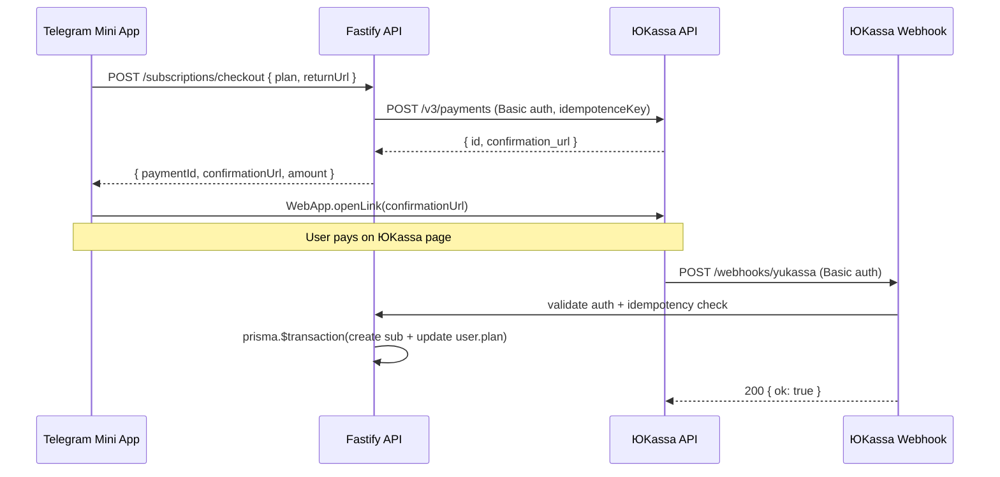

# Architecture: payments-subscription

## Overview

Payments flow uses a standard redirect-based checkout pattern via ЮKassa v3 API. No PCI scope — we redirect users to ЮKassa's hosted payment page.



## Components

| Component | Location | Responsibility |
|-----------|----------|----------------|
| PaymentService | apps/api/src/services/PaymentService.ts | ЮKassa API client |
| subscriptions route | apps/api/src/routes/subscriptions.ts | /checkout endpoint |
| webhooks route | apps/api/src/routes/webhooks.ts | /yukassa webhook |
| Paywall page | apps/tma/src/pages/Paywall.tsx | UI plan selector + checkout |
| KlyovoSubscription | packages/db/schema.prisma | payment audit log |

## Security

- Webhook auth: `crypto.timingSafeEqual` prevents timing attacks
- API keys: env vars only (Yandex Lockbox in prod)
- No card data ever touches our servers (hosted payment page)
- ФЗ-54: receipt included in every payment creation

## Data Model

```
User {
  plan: FREE | PLUS
  planExpiresAt: DateTime?
}

KlyovoSubscription {
  id
  userId (FK)
  plan: plus_monthly | plus_yearly
  status: active | cancelled | expired
  yookassaPaymentId (UNIQUE — idempotency key)
  startedAt
  expiresAt
}
```

## Consistency with docs/Architecture.md

- Fastify 5 + TypeScript strict ✓
- Prisma 5 + parameterized queries ✓
- Zod validation on all endpoints ✓
- Yandex Cloud (ru-central1) storage ✓
- No float money — all amounts in kopecks ✓
