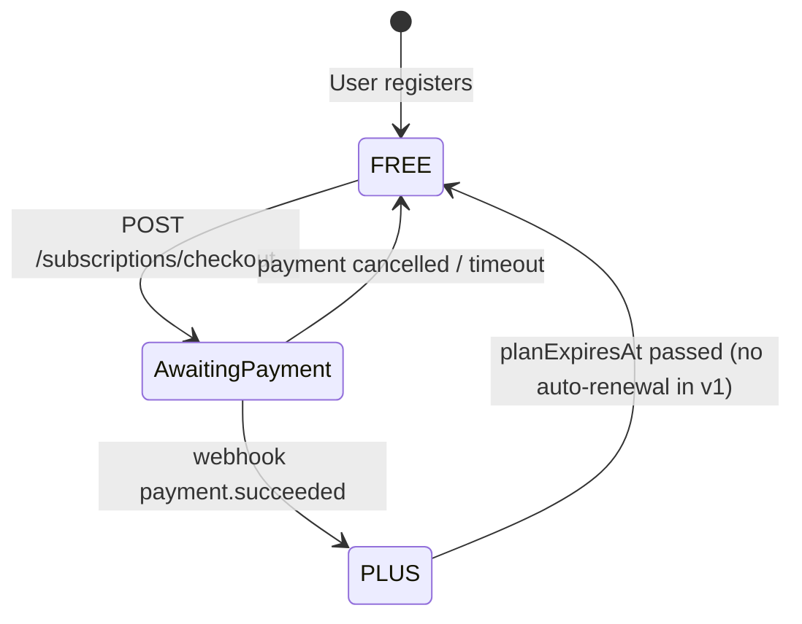

# Pseudocode: payments-subscription

## Core Algorithms

### Algorithm: createPayment
INPUT: userId, userEmail, plan, amountKopecks, returnUrl
OUTPUT: { paymentId, confirmationUrl, amount }

```
STEPS:
1. READ YUKASSA_SHOP_ID, YUKASSA_SECRET_KEY from env
2. IF missing → THROW 503 PAYMENT_FAILED

3. amountRub ← (amountKopecks / 100).toFixed(2)
4. description ← plan === 'plus_monthly' ? 'Клёво Плюс — 1 месяц' : 'Клёво Плюс — 1 год'
5. idempotenceKey ← `${userId}-${plan}-${Date.now()}`
   // Intentionally unique per attempt: ЮKassa idempotency prevents HTTP retries of the
   // SAME request; our own duplicate-activation guard is yookassaPaymentId UNIQUE constraint.
   // A deterministic key (no timestamp) would block the same user from starting a new payment
   // after cancelling the previous one.

6. POST https://api.yookassa.ru/v3/payments
   Headers: Authorization: Basic base64(shopId:secret)
            Idempotence-Key: idempotenceKey
   Body: {
     amount: { value: amountRub, currency: "RUB" },
     confirmation: { type: "redirect", return_url: returnUrl },
     description,
     receipt: {
       customer: { email: userEmail },
       items: [{ description, quantity: "1.00", amount, vat_code: 1 }]
     },
     metadata: { userId, plan },
     capture: true
   }

7. IF response.ok = false → THROW 502 PAYMENT_FAILED
8. RETURN { paymentId: data.id, confirmationUrl: data.confirmation.confirmation_url, amount: amountKopecks }
```

### Algorithm: processWebhook
INPUT: YookassaWebhookPayload, Basic auth header, env vars
OUTPUT: { ok: true }

```
STEPS:
1. READ Authorization header
2. IF missing → THROW 401

3. expected ← Base64(YUKASSA_SHOP_ID:YUKASSA_SECRET_KEY)
4. IF !timingSafeEqual(header, expected) → THROW 401

5. IF event !== 'payment.succeeded' OR paid !== true → RETURN { ok: true }

6. paymentId ← payload.object.id
7. userId, plan ← payload.object.metadata

8. IF missing userId or plan → LOG warn, RETURN { ok: true }

9. existing ← prisma.klyovoSubscription.findUnique(yookassaPaymentId)
10. IF existing → RETURN { ok: true }  // idempotent (soft check)
   // Hard guarantee: yookassaPaymentId has @unique DB constraint — concurrent duplicate
   // webhooks will throw on prisma.create, which is caught by error handler → 500 logged.
   // ЮKassa retries on 5xx, but the second attempt hits soft check → 200 ok.

11. now ← new Date()
12. expiresAt ← plan === 'plus_monthly' ? now + 30d : now + 365d

13. prisma.$transaction([
      klyovoSubscription.create({ userId, plan, status: 'active', yookassaPaymentId, startedAt: now, expiresAt }),
      user.update({ plan: 'PLUS', planExpiresAt: expiresAt })
    ])

14. LOG info { userId, plan, paymentId }
15. RETURN { ok: true }
```

### Algorithm: getSubscriptionStatus
INPUT: userId
OUTPUT: { plan, planExpiresAt, isActive }

```
STEPS:
1. user ← prisma.user.findUniqueOrThrow({ where: { id: userId } })
2. isActive ← user.plan === 'PLUS' AND (planExpiresAt === null OR planExpiresAt > now)
   // null planExpiresAt = lifetime (admin grant); OR short-circuits correctly in TypeScript
3. RETURN { plan: user.plan, planExpiresAt: user.planExpiresAt, isActive }
```

## State Transitions



## Error Handling

| Error | Code | HTTP |
|-------|------|------|
| ЮKassa env missing | PAYMENT_FAILED | 503 |
| ЮKassa API error | PAYMENT_FAILED | 502 |
| Invalid webhook auth | — | 401 |
| Invalid plan value | VALIDATION_ERROR | 400 |
| User not found | NOT_FOUND | 404 |
